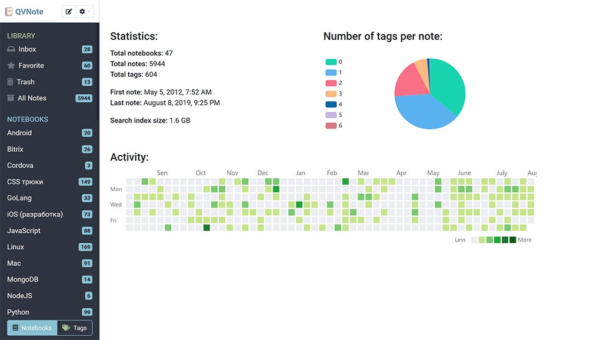

    

# QVNote v2.3.0

The program for storing notes, pages of sites, personal knowledge base and any other text data

English/Russian languages

All data stored in JSON format (format based on [Quiver](http://happenapps.com/))

Written with GoLang and VueJS

**Server-only mode** — lightweight HTTP server, no desktop GUI dependencies.

More info here - https://qvnote.fsky.info/



## Usage

You can always download latest stable binary from here - https://github.com/NightMan-1/QVNote/releases/latest - or build from sources

## Build from source

#### Project requirements

GoLang >=1.26  
NodeJS >=18.x

Frontend stack: **Vue 3**, **Vite**, **Pinia**, **vue-i18n**, **HugeRTE**.

#### Project setup

```bash
git clone https://github.com/NightMan-1/QVNote
cd QVNote
npm install
```

#### Compiles for production

```bash
npm run build
go build
```
Now you can run the QVNote binary.

#### Development

```bash
./qvnote                   # backend on :8000
npm run serve              # frontend dev on :8080 (proxies /api to :8000)
```
Open http://localhost:8080

## Command line parameters

```
--help
    usage info
--port=8000
    listen port
--datadir
    data folder, default $HOME/.config/QVNote
```

Optional configuration file: `config.ini` (same keys as CLI flags).

