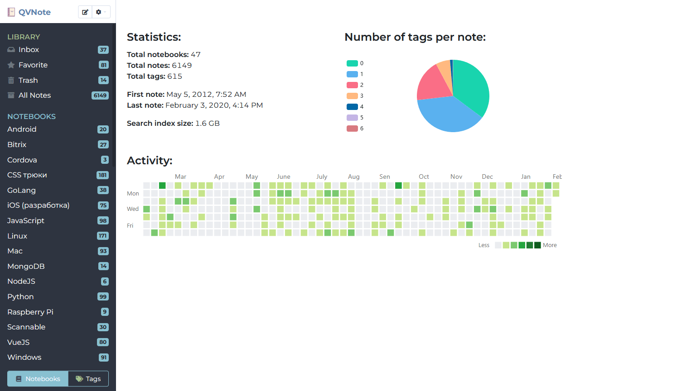

    

# QVNote

The program for storing notes, pages of sites, personal knowledge base and any other text data

English/Russian languages

All data stored in JSON format (format based on [Quiver](http://happenapps.com/))

Written with GoLang and VueJS

**Requires Chrome/Chromium >= 70 to be installed**

More info here - https://qvnote.fsky.info/



## Usage

You can always download latest stable binary from here - https://github.com/NightMan-1/QVNote/releases/latest - or build from sources

## Build from source

#### Project request

GoLang >1.17  
NodeJS >16.x

#### Project setup

```bash
git clone https://github.com/NightMan-1/QVNote
cd QVNote
go install github.com/go-bindata/go-bindata/...@latest
go install github.com/josephspurrier/goversioninfo/cmd/goversioninfo@latest

npm install
```

#### Compiles for production

```bash
npm run build
cd templates
go-bindata -o ../bindata.go -fs ./... ../icon.ico
cd ..
goversioninfo
go build
```
now you can run QVNote binary

#### GUI development

run server (QVNote.exe)
npm run serve
open http://localhost:8080

## Command line parameters:
    --help
        usage info
    --port=8000
        listen port
    --portable
        portable mode for Windows OS, data will be stored in app folder
    --server
        server mode without systray and other GUI
    --datadir
        data folder, default $HOME/.config/QVNote or %USERPROFILE%/.config/QVNote

Also you can you optional configuration file "config.ini"

